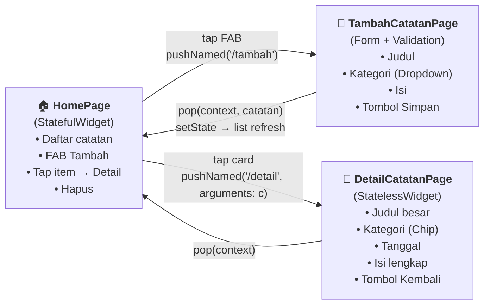
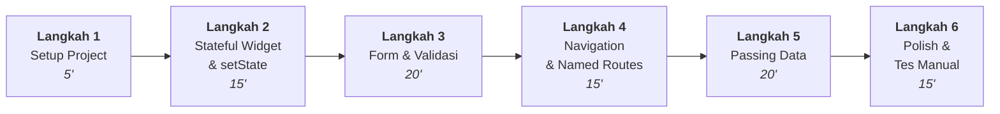
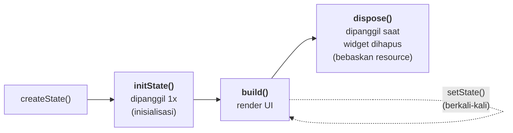
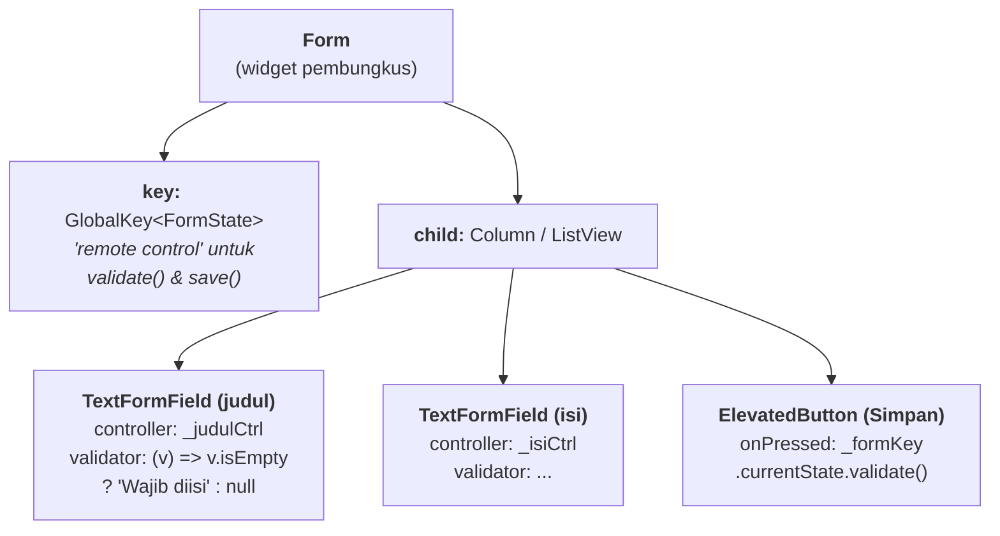
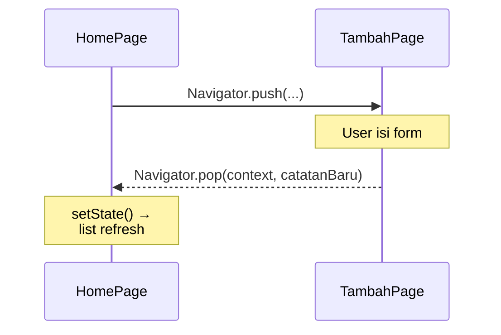

# Praktikum Pertemuan 3 — Stateful Widget, Form, & Navigation

## Informasi Umum

| Item             | Keterangan                                                       |
| ---------------- | ---------------------------------------------------------------- |
| Pertemuan        | Minggu 3 (Lanjutan setelah Scaffold & Komponen Widget)           |
| Topik Kuliah     | State Management dasar, Form & Input, Navigation antar halaman   |
| Durasi Praktikum | 100 menit                                                        |
| Prasyarat        | Pertemuan 1 (Hello World) & Pertemuan 2 (Scaffold) selesai       |

---

## Tujuan Praktikum

Setelah menyelesaikan praktikum ini, mahasiswa mampu:

1. Membedakan **StatelessWidget** vs **StatefulWidget** dan tahu kapan masing-masing dipakai
2. Menggunakan **`setState()`** untuk memperbarui UI ketika data berubah
3. Memahami **lifecycle** sederhana StatefulWidget (`initState`, `build`, `dispose`)
4. Membangun **Form** dengan `TextFormField`, `GlobalKey<FormState>`, dan **validasi input**
5. Mengelola input user dengan **`TextEditingController`** dan membebaskan resource-nya pada `dispose`
6. Berpindah antar halaman dengan **`Navigator.push`** & **`Navigator.pop`**
7. Mendaftarkan **Named Routes** di `MaterialApp.routes` & `onGenerateRoute`
8. **Mengirim data** dari halaman A → B (via constructor / arguments) dan **mengembalikan data** dari B → A (via `Navigator.pop(context, value)`)

> Pertemuan 2 menanyakan: "Widget apa yang harus saya pakai?". Pertemuan 3 menjawab: "Bagaimana widget-widget itu **berubah** dan **saling terhubung**?"

---

## Gambaran Hasil Akhir

Pada akhir praktikum ini, mahasiswa akan punya satu project Flutter (`pertemuan_3`) berjudul **"Mini App Catatan Mahasiswa"** dengan tiga halaman yang saling terhubung:



**Alur kerja user:**
1. Buka app → lihat daftar catatan (Home)
2. Tap FAB **+ Tambah** → masuk halaman Tambah → isi form → tekan **Simpan**
3. Validasi jalan; jika lolos → kembali ke Home, list otomatis bertambah
4. Tap salah satu catatan di Home → masuk halaman Detail
5. Tekan back → kembali ke Home

---

## Alur Praktikum



---

## Langkah 1 — Setup Project (5 menit)

Buka folder kerja Anda, lalu:

```bash
flutter create pertemuan_3
cd pertemuan_3
flutter run
```

Pastikan aplikasi default (counter) muncul. Buka `lib/main.dart` dan **hapus seluruh isinya** — kita akan menulis ulang dari nol.

Mulai dengan template minimal berikut:

```dart
import 'package:flutter/material.dart';

void main() {
  runApp(const MyApp());
}

class MyApp extends StatelessWidget {
  const MyApp({super.key});

  @override
  Widget build(BuildContext context) {
    return MaterialApp(
      title: 'Catatan Mahasiswa',
      debugShowCheckedModeBanner: false,
      theme: ThemeData(colorSchemeSeed: Colors.indigo, useMaterial3: true),
      home: const HomePage(), // sementara, nanti diganti dengan named routes
    );
  }
}

class HomePage extends StatelessWidget {
  const HomePage({super.key});
  @override
  Widget build(BuildContext context) {
    return Scaffold(
      appBar: AppBar(title: const Text('Catatan Mahasiswa')),
      body: const Center(child: Text('Halo, ini Home!')),
    );
  }
}
```

Jalankan dengan **hot reload** (`r`) — pastikan teks "Halo, ini Home!" muncul.

---

## Langkah 2 — StatefulWidget & `setState` (15 menit)

### 2.1 Konsep: Stateless vs Stateful

| Aspek              | StatelessWidget               | StatefulWidget                          |
| ------------------ | ----------------------------- | --------------------------------------- |
| Data internal      | Tidak punya state             | Punya state yang bisa berubah           |
| Dibangun ulang     | Hanya saat parent re-build    | Bisa dibangun ulang via `setState()`    |
| Contoh penggunaan  | Tampilan statis, kartu, label | Form, counter, list yang bisa berubah   |
| Method utama       | `build()`                     | `createState()` → `State<T>` dgn `build`|

> **Aturan praktis**: kalau data di dalam widget **akan berubah selama widget hidup** (mis. list catatan bertambah), pakai `StatefulWidget`.

### 2.2 Konversi HomePage menjadi StatefulWidget

Buat **model** dulu (di atas `class MyApp`):

```dart
class Catatan {
  final String judul;
  final String isi;
  final String kategori;
  final DateTime dibuatPada;

  Catatan({
    required this.judul,
    required this.isi,
    required this.kategori,
    required this.dibuatPada,
  });
}
```

Lalu ubah `HomePage` jadi Stateful:

```dart
class HomePage extends StatefulWidget {
  const HomePage({super.key});

  @override
  State<HomePage> createState() => _HomePageState();
}

class _HomePageState extends State<HomePage> {
  // === STATE ===
  final List<Catatan> _catatan = [
    Catatan(
      judul: 'Belajar Flutter',
      isi: 'Mempelajari Stateful Widget, Form, dan Navigation.',
      kategori: 'Kuliah',
      dibuatPada: DateTime.now(),
    ),
  ];

  void _tambahDummy() {
    setState(() {
      _catatan.add(Catatan(
        judul: 'Catatan ${_catatan.length + 1}',
        isi: 'Isi dummy',
        kategori: 'Lainnya',
        dibuatPada: DateTime.now(),
      ));
    });
  }

  @override
  Widget build(BuildContext context) {
    return Scaffold(
      appBar: AppBar(title: const Text('Catatan Mahasiswa')),
      body: ListView.builder(
        itemCount: _catatan.length,
        itemBuilder: (context, i) {
          final c = _catatan[i];
          return ListTile(
            title: Text(c.judul),
            subtitle: Text(c.kategori),
          );
        },
      ),
      floatingActionButton: FloatingActionButton(
        onPressed: _tambahDummy,
        child: const Icon(Icons.add),
      ),
    );
  }
}
```

**Coba**: jalankan, tekan FAB beberapa kali — list bertambah. Inilah inti `setState()`: ia memberi tahu Flutter, *"data berubah, tolong rebuild widget ini."*

> ⚠️ **Common mistake**: jangan ubah `_catatan` langsung tanpa `setState`. UI tidak akan refresh.
>
> ```dart
> // ❌ SALAH
> _catatan.add(...);          // data berubah tapi UI tidak rebuild
>
> // ✅ BENAR
> setState(() => _catatan.add(...));
> ```

### 2.3 Sekilas tentang Lifecycle



Kita akan pakai `dispose()` di Langkah 3 untuk membersihkan `TextEditingController`.

---

## Langkah 3 — Form & Validasi (20 menit)

### 3.1 Anatomi Form di Flutter



Tiga elemen kunci:

| Elemen                  | Fungsi                                                          |
| ----------------------- | --------------------------------------------------------------- |
| `GlobalKey<FormState>`  | Identifier unik untuk Form, dipakai memanggil `validate()`      |
| `TextEditingController` | Membaca/menulis nilai TextField secara terprogram               |
| `validator`             | Fungsi yang mengembalikan **String** (error) atau **null** (ok) |

### 3.2 Buat Halaman TambahCatatanPage

Tambahkan class baru di bawah `_HomePageState`:

```dart
class TambahCatatanPage extends StatefulWidget {
  const TambahCatatanPage({super.key});

  @override
  State<TambahCatatanPage> createState() => _TambahCatatanPageState();
}

class _TambahCatatanPageState extends State<TambahCatatanPage> {
  final _formKey = GlobalKey<FormState>();
  final _judulCtrl = TextEditingController();
  final _isiCtrl = TextEditingController();

  String _kategori = 'Kuliah';
  final _kategoriOpsi = const ['Kuliah', 'Tugas', 'Pribadi', 'Lainnya'];

  @override
  void dispose() {
    // PENTING: bebaskan resource controller agar tidak memory leak.
    _judulCtrl.dispose();
    _isiCtrl.dispose();
    super.dispose();
  }

  void _simpan() {
    if (!_formKey.currentState!.validate()) return;

    // Untuk sekarang, hanya tampilkan SnackBar.
    // Nanti di Langkah 5 kita kirim data balik ke HomePage.
    ScaffoldMessenger.of(context).showSnackBar(
      SnackBar(content: Text('Tersimpan: ${_judulCtrl.text}')),
    );
  }

  @override
  Widget build(BuildContext context) {
    return Scaffold(
      appBar: AppBar(title: const Text('Tambah Catatan')),
      body: Form(
        key: _formKey,
        child: ListView(
          padding: const EdgeInsets.all(16),
          children: [
            TextFormField(
              controller: _judulCtrl,
              decoration: const InputDecoration(
                labelText: 'Judul',
                prefixIcon: Icon(Icons.title),
                border: OutlineInputBorder(),
              ),
              validator: (v) {
                if (v == null || v.trim().isEmpty) return 'Judul wajib diisi';
                if (v.trim().length < 3) return 'Minimal 3 karakter';
                return null;
              },
            ),
            const SizedBox(height: 16),
            DropdownButtonFormField<String>(
              value: _kategori,
              decoration: const InputDecoration(
                labelText: 'Kategori',
                prefixIcon: Icon(Icons.category),
                border: OutlineInputBorder(),
              ),
              items: _kategoriOpsi
                  .map((k) => DropdownMenuItem(value: k, child: Text(k)))
                  .toList(),
              onChanged: (v) => setState(() => _kategori = v!),
            ),
            const SizedBox(height: 16),
            TextFormField(
              controller: _isiCtrl,
              maxLines: 5,
              decoration: const InputDecoration(
                labelText: 'Isi',
                prefixIcon: Icon(Icons.notes),
                border: OutlineInputBorder(),
              ),
              validator: (v) =>
                  (v == null || v.trim().isEmpty) ? 'Isi wajib diisi' : null,
            ),
            const SizedBox(height: 24),
            FilledButton.icon(
              onPressed: _simpan,
              icon: const Icon(Icons.save),
              label: const Text('Simpan'),
            ),
          ],
        ),
      ),
    );
  }
}
```

> 🎯 **Coba sendiri** (sementara, tambahkan tombol sementara di HomePage untuk buka halaman ini):
>
> ```dart
> floatingActionButton: FloatingActionButton(
>   onPressed: () {
>     Navigator.push(context,
>       MaterialPageRoute(builder: (_) => const TambahCatatanPage()));
>   },
>   child: const Icon(Icons.add),
> ),
> ```
>
> Test: kosongkan judul → tekan Simpan → muncul pesan error merah di bawah field. Itulah validator bekerja.

### 3.3 Aturan main validator

| Return value      | Arti                                       |
| ----------------- | ------------------------------------------ |
| `null`            | Input **valid** — tidak ada error          |
| `String` (apapun) | Input **tidak valid** — string itu ditampilkan sebagai pesan error |

---

## Langkah 4 — Navigation & Named Routes (15 menit)

### 4.1 Dua gaya navigasi

**A) Anonymous route (sudah dipakai di Langkah 3):**

```dart
Navigator.push(
  context,
  MaterialPageRoute(builder: (_) => const TambahCatatanPage()),
);
```

Cepat, langsung. Tapi sulit dilacak kalau aplikasi besar.

**B) Named route (lebih rapi, mirip URL):**

Di `MaterialApp`, daftarkan route:

```dart
return MaterialApp(
  // ...
  initialRoute: '/',
  routes: {
    '/': (context) => const HomePage(),
    '/tambah': (context) => const TambahCatatanPage(),
  },
);
```

Lalu navigasi cukup dengan:

```dart
Navigator.pushNamed(context, '/tambah');
```

### 4.2 Kapan pakai `onGenerateRoute`?

Kalau halaman butuh **argumen wajib** (mis. `DetailCatatanPage` butuh objek `Catatan`), `routes:` biasa tidak cukup. Kita pakai `onGenerateRoute`:

```dart
onGenerateRoute: (settings) {
  switch (settings.name) {
    case '/tambah':
      return MaterialPageRoute(builder: (_) => const TambahCatatanPage());
    case '/detail':
      final catatan = settings.arguments as Catatan;
      return MaterialPageRoute(
        builder: (_) => DetailCatatanPage(catatan: catatan),
      );
  }
  return null;
},
```

### 4.3 Push vs Pop



`pop` juga bisa **membawa data balik**:

```dart
Navigator.pop(context, catatanBaru);  // dari TambahPage
```

Yang ditangkap di HomePage dengan `await`:

```dart
final hasil = await Navigator.pushNamed(context, '/tambah');
```

Ini yang kita pakai di Langkah 5.

---

## Langkah 5 — Passing Data antar Halaman (20 menit)

### 5.1 Detail Page menerima data via constructor

Tambahkan class baru:

```dart
class DetailCatatanPage extends StatelessWidget {
  final Catatan catatan;
  const DetailCatatanPage({super.key, required this.catatan});

  @override
  Widget build(BuildContext context) {
    return Scaffold(
      appBar: AppBar(title: const Text('Detail Catatan')),
      body: SingleChildScrollView(
        padding: const EdgeInsets.all(20),
        child: Column(
          crossAxisAlignment: CrossAxisAlignment.start,
          children: [
            Text(catatan.judul,
                style: const TextStyle(
                    fontSize: 24, fontWeight: FontWeight.bold)),
            const SizedBox(height: 8),
            Chip(label: Text(catatan.kategori)),
            const Divider(height: 32),
            Text(catatan.isi,
                style: const TextStyle(fontSize: 16, height: 1.5)),
          ],
        ),
      ),
    );
  }
}
```

### 5.2 Halaman Tambah mengirim data balik

Ubah method `_simpan()` di `TambahCatatanPage`:

```dart
void _simpan() {
  if (!_formKey.currentState!.validate()) return;

  final catatanBaru = Catatan(
    judul: _judulCtrl.text.trim(),
    isi: _isiCtrl.text.trim(),
    kategori: _kategori,
    dibuatPada: DateTime.now(),
  );

  Navigator.pop(context, catatanBaru); // <-- kirim balik!
}
```

### 5.3 HomePage menangkap data & memanggil `setState`

Di `_HomePageState`, ganti `_tambahDummy` menjadi:

```dart
Future<void> _bukaTambahCatatan() async {
  final hasil = await Navigator.pushNamed(context, '/tambah');

  if (hasil is Catatan) {
    setState(() => _catatan.add(hasil));

    if (!mounted) return;
    ScaffoldMessenger.of(context).showSnackBar(
      SnackBar(content: Text('Catatan "${hasil.judul}" ditambahkan')),
    );
  }
}
```

Juga tambahkan `onTap` di `ListTile` untuk navigasi ke detail:

```dart
onTap: () {
  Navigator.pushNamed(context, '/detail', arguments: c);
},
```

### 5.4 Update `MaterialApp` dengan named routes

```dart
return MaterialApp(
  title: 'Catatan Mahasiswa',
  debugShowCheckedModeBanner: false,
  theme: ThemeData(colorSchemeSeed: Colors.indigo, useMaterial3: true),
  initialRoute: '/',
  routes: {
    '/': (context) => const HomePage(),
  },
  onGenerateRoute: (settings) {
    switch (settings.name) {
      case '/tambah':
        return MaterialPageRoute(builder: (_) => const TambahCatatanPage());
      case '/detail':
        final catatan = settings.arguments as Catatan;
        return MaterialPageRoute(
          builder: (_) => DetailCatatanPage(catatan: catatan),
        );
    }
    return null;
  },
);
```

> ⚠️ **Penting tentang `mounted`**: setelah `await`, widget bisa saja sudah di-dispose (user pencet back). Maka cek `if (!mounted) return;` sebelum pakai `context` lagi (`ScaffoldMessenger.of(context)`).

---

## Langkah 6 — Polish & Tes Manual (15 menit)

### 6.1 Tambahkan empty state, tombol hapus, dan tanggal

(Lihat file `lib/main.dart` lengkap di project — `_EmptyState`, tombol delete di `ListTile`, helper `_formatTanggal`.)

### 6.2 Skenario Tes Manual (checklist)

Jalankan `flutter run`, lalu cek:

- [ ] Saat pertama buka, ada 1 catatan dummy "Belajar Flutter"
- [ ] Tap FAB **Tambah** → halaman form muncul
- [ ] Tekan **Simpan** dengan field kosong → muncul pesan error merah
- [ ] Isi judul kurang dari 3 karakter → muncul "Minimal 3 karakter"
- [ ] Isi semua field dengan benar → tekan **Simpan** → kembali ke Home, list bertambah, muncul SnackBar
- [ ] Tap salah satu item → halaman Detail muncul dengan data benar
- [ ] Tekan back / tombol "Kembali ke Daftar" → balik ke Home
- [ ] Tap ikon hapus di salah satu item → item hilang
- [ ] Hapus semua → muncul empty state "Belum ada catatan"

---

## Ringkasan Konsep

| Konsep                  | API/Widget kunci                           | Kapan dipakai                            |
| ----------------------- | ------------------------------------------ | ---------------------------------------- |
| State berubah           | `StatefulWidget` + `setState()`            | List bertambah, counter, toggle, dsb     |
| Inisialisasi & cleanup  | `initState()` / `dispose()`                | Buat/bebaskan controller, listener, timer|
| Form & validasi         | `Form` + `GlobalKey<FormState>` + validator| Input user yang harus dicek              |
| Baca nilai TextField    | `TextEditingController`                    | Akses `.text` secara terprogram          |
| Navigasi cepat          | `Navigator.push(MaterialPageRoute(...))`   | App kecil, route ad-hoc                  |
| Navigasi terstruktur    | `routes:` & `pushNamed`                    | App medium, route stabil                 |
| Navigasi + argumen      | `onGenerateRoute` + `settings.arguments`   | Halaman butuh data wajib                 |
| Kirim data B → A        | `Navigator.pop(context, value)` + `await`  | Form modal, picker, dialog               |

---

## Pertanyaan Refleksi

1. Apa beda **StatelessWidget** dan **StatefulWidget**? Sebutkan satu contoh konkret kapan masing-masing dipakai.
2. Mengapa kita harus memanggil `setState()` saat mengubah data? Apa yang terjadi kalau lupa?
3. Apa fungsi `GlobalKey<FormState>`? Mengapa tidak cukup `TextEditingController` saja?
4. Mengapa `TextEditingController` perlu di-`dispose()`?
5. Apa beda `Navigator.push` dengan `Navigator.pushNamed`? Kapan pakai yang mana?
6. Bagaimana cara mengirim data **balik** dari halaman B ke halaman A?
7. Mengapa kita perlu cek `if (!mounted) return;` setelah `await`?

---

## Tugas Mandiri

Pilih **salah satu** untuk dikerjakan dan dikumpulkan:

1. **Fitur Edit Catatan** — buat halaman Edit yang me-reuse `TambahCatatanPage`. Tap detail → ada tombol Edit → buka form dengan field terisi data lama → simpan → list ter-update (bukan ditambah baru).
2. **Filter berdasarkan Kategori** — tambahkan dropdown di AppBar Home untuk memfilter list berdasarkan kategori (Kuliah/Tugas/Pribadi/Lainnya/Semua).
3. **Validasi Lanjutan** — tambahkan field "Email pengirim" di form, dengan validasi regex format email yang benar.

Kumpulkan: link repository Git berisi project `pertemuan_3` + screenshot hasil + jawaban Pertanyaan Refleksi.

---

## Referensi

- [Flutter Docs — State management intro](https://docs.flutter.dev/data-and-backend/state-mgmt/intro)
- [Flutter Cookbook — Build a form with validation](https://docs.flutter.dev/cookbook/forms/validation)
- [Flutter Cookbook — Navigate to a new screen and back](https://docs.flutter.dev/cookbook/navigation/navigation-basics)
- [Flutter Cookbook — Navigate with named routes](https://docs.flutter.dev/cookbook/navigation/named-routes)
- [Flutter Cookbook — Send data to a new screen](https://docs.flutter.dev/cookbook/navigation/passing-data)
- [Flutter Cookbook — Return data from a screen](https://docs.flutter.dev/cookbook/navigation/returning-data)
