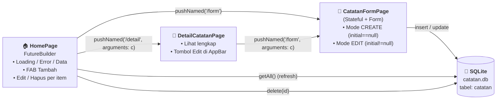
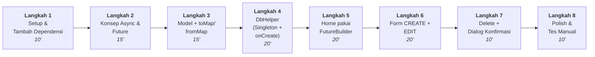
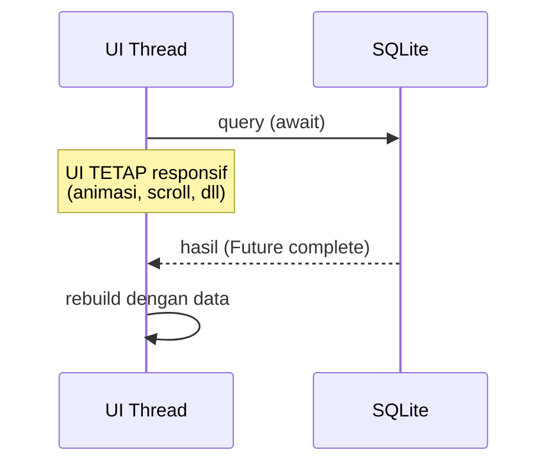
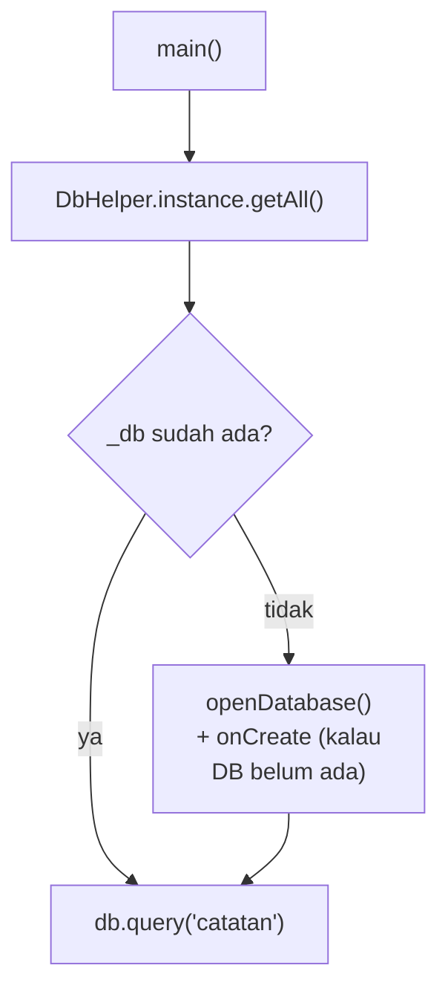
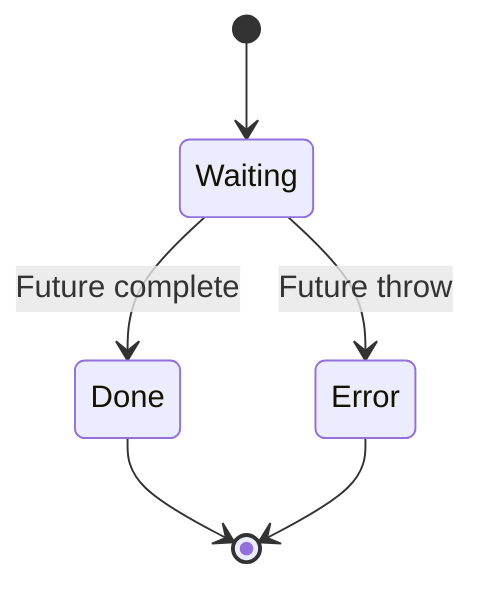

# Praktikum Pertemuan 4 — Persistensi Data dengan SQLite (sqflite) & CRUD Penuh

## Informasi Umum

| Item             | Keterangan                                                          |
| ---------------- | ------------------------------------------------------------------- |
| Pertemuan        | Minggu 4 (Lanjutan setelah Stateful, Form, & Navigation)            |
| Topik Kuliah     | Async/await, `Future`, `FutureBuilder`, SQLite (`sqflite`), CRUD    |
| Durasi Praktikum | 120 menit                                                           |
| Prasyarat        | Pertemuan 1 → 3 selesai (terutama Stateful + Form + Named Routes)   |

---

## Tujuan Praktikum

Setelah menyelesaikan praktikum ini, mahasiswa mampu:

1. Menjelaskan perbedaan operasi **sinkron** vs **asinkron** dan kapan masing-masing dipakai
2. Memakai **`async`/`await`** dan **`Future<T>`** untuk operasi I/O (database)
3. Menampilkan UI berbeda untuk **3 state** (loading / error / data) menggunakan **`FutureBuilder`**
4. Membuat tabel SQLite & menjalankan **CRUD** (Create, Read, Update, Delete) lewat package **`sqflite`**
5. Memetakan objek Dart ↔ baris database lewat **`toMap()`** dan **`fromMap()`**
6. Memisahkan akses data ke dalam **repository** (`DbHelper`) sehingga UI tidak langsung tahu detail SQL
7. Menangani **dialog konfirmasi** untuk aksi destruktif (hapus)
8. Mendesain **satu form** yang dipakai untuk dua mode: **Create** dan **Edit**

> Pertemuan 3 menjawab: "Bagaimana state berubah?". Pertemuan 4 menjawab: "Bagaimana data **tidak hilang** saat aplikasi ditutup?"

---

## Mengapa SQLite?

Sampai Pertemuan 3, list catatan disimpan di memori (`List<Catatan>` di `_HomePageState`). Konsekuensinya: **app ditutup → data lenyap**. Untuk app sungguhan kita butuh **persistensi**.

Pilihan persistensi di Flutter:

| Mekanisme               | Cocok untuk                                              | Contoh                       |
| ----------------------- | -------------------------------------------------------- | ---------------------------- |
| `SharedPreferences`     | Setting kecil, key-value sederhana                       | Tema, last login, flag       |
| File (`path_provider`)  | File besar / data binary                                 | Gambar, log, export          |
| **SQLite (`sqflite`)**  | **Data terstruktur dengan query** (filter, sort, join)   | **Catatan, kontak, todo**    |
| Backend / REST          | Data perlu sinkron lintas device                         | Chat, sosmed                 |

Untuk app **Catatan Mahasiswa** dengan fitur filter/sort/edit, SQLite adalah pilihan paling pas.

---

## Gambaran Hasil Akhir



Beda utama dibanding Pertemuan 3:

| Aspek                  | Pertemuan 3                    | Pertemuan 4                                |
| ---------------------- | ------------------------------ | ------------------------------------------ |
| Penyimpanan            | `List<Catatan>` di memori      | **SQLite** (`catatan.db`)                  |
| Persistensi            | Hilang saat restart            | **Bertahan** lintas restart                |
| Render list            | `ListView` langsung dari list  | **`FutureBuilder`** dari `getAll()`        |
| Mode Form              | Hanya Tambah                   | **Tambah + Edit** (satu page reusable)     |
| Hapus                  | Tap ikon → langsung hilang     | Tap ikon → **dialog konfirmasi** → hapus   |
| Akses data             | Langsung di `_HomePageState`   | Lewat **`DbHelper`** (repository)          |

---

## Alur Praktikum



---

## Langkah 1 — Setup Project (10 menit)

### 1.1 Buat project baru, copy dari P3

```bash
flutter create pertemuan_4
cd pertemuan_4
```

Copy isi `lib/main.dart` dari `pertemuan_3` ke `pertemuan_4/lib/main.dart` sebagai titik awal — kita akan **refactor** secara bertahap, bukan mulai dari nol.

### 1.2 Tambahkan dependensi `sqflite` & `path`

Buka `pubspec.yaml`, tambahkan di bawah `cupertino_icons`:

```yaml
dependencies:
  flutter:
    sdk: flutter
  cupertino_icons: ^1.0.8

  # === Baru di Pertemuan 4 ===
  sqflite: ^2.3.3+1   # akses SQLite di Android/iOS
  path: ^1.9.0        # helper join path (lokasi DB)
```

Lalu jalankan:

```bash
flutter pub get
```

### 1.3 Inisialisasi binding di `main()`

`sqflite` memanggil platform channel saat membuka database. Maka di `main()` **wajib** memanggil:

```dart
void main() {
  WidgetsFlutterBinding.ensureInitialized();
  runApp(const MyApp());
}
```

> ⚠️ Tanpa baris itu, app akan crash di pemanggilan DB pertama dengan error `Binding has not yet been initialized`.

### 1.4 (Opsional) Catatan platform

- **Android / iOS / emulator**: jalan langsung, tidak perlu konfigurasi tambahan.
- **macOS / Windows / Linux desktop**: butuh `sqflite_common_ffi` + inisialisasi `databaseFactory`. Praktikum ini diasumsikan jalan di **Android emulator** atau **iOS simulator**.

---

## Langkah 2 — Konsep Async & Future (15 menit)

### 2.1 Kenapa async penting?

Operasi seperti membaca file, query database, atau panggil API butuh waktu. Kalau dijalankan **sinkron**, UI Flutter akan **freeze** karena single-threaded.



### 2.2 Anatomi `Future` & `async/await`

```dart
// Function async SELALU mengembalikan Future<T>.
Future<List<Catatan>> getAll() async {
  final db = await database;            // tunggu DB siap
  final rows = await db.query('catatan'); // tunggu query selesai
  return rows.map(Catatan.fromMap).toList();
}
```

| Konsep         | Penjelasan singkat                                              |
| -------------- | --------------------------------------------------------------- |
| `Future<T>`    | "Janji" bahwa nanti akan ada nilai `T` (atau error)             |
| `async`        | Menandai function mengembalikan Future & boleh pakai `await`    |
| `await`        | "Tunggu Future ini selesai, baru lanjutkan baris berikutnya"    |
| `.then((v){})` | Cara lain konsumsi Future (callback-style), jarang dipakai lagi |

> 💡 **Aturan praktis**: kalau function memanggil `await` di dalamnya, dia HARUS `async` dan return type-nya `Future<...>`.

### 2.3 Latihan 1 menit (di DartPad)

```dart
Future<int> ambilNilai() async {
  await Future.delayed(const Duration(seconds: 2));
  return 42;
}

void main() async {
  print('Mulai');
  final hasil = await ambilNilai();
  print('Hasil: $hasil');
  print('Selesai');
}
```

Outputnya:
```
Mulai
(jeda 2 detik)
Hasil: 42
Selesai
```

---

## Langkah 3 — Refactor Model Catatan (15 menit)

Database punya **primary key**. Maka model `Catatan` perlu field `id` (nullable, karena objek baru belum punya id sebelum diinsert).

Ganti class `Catatan` di `lib/main.dart`:

```dart
class Catatan {
  final int? id;                 // <- baru, nullable
  final String judul;
  final String isi;
  final String kategori;
  final DateTime dibuatPada;

  Catatan({
    this.id,
    required this.judul,
    required this.isi,
    required this.kategori,
    required this.dibuatPada,
  });

  // === Dart object → row Map ===
  Map<String, Object?> toMap() => {
        if (id != null) 'id': id,
        'judul': judul,
        'isi': isi,
        'kategori': kategori,
        'dibuat_pada': dibuatPada.millisecondsSinceEpoch,
      };

  // === Row Map → Dart object ===
  static Catatan fromMap(Map<String, Object?> m) => Catatan(
        id: m['id'] as int?,
        judul: m['judul'] as String,
        isi: m['isi'] as String,
        kategori: m['kategori'] as String,
        dibuatPada:
            DateTime.fromMillisecondsSinceEpoch(m['dibuat_pada'] as int),
      );

  // Helper untuk Edit — copy dengan beberapa field diganti.
  Catatan copyWith({String? judul, String? isi, String? kategori}) =>
      Catatan(
        id: id,
        judul: judul ?? this.judul,
        isi: isi ?? this.isi,
        kategori: kategori ?? this.kategori,
        dibuatPada: dibuatPada,
      );
}
```

> 💡 **Kenapa `DateTime` disimpan sebagai `int`?** SQLite tidak punya tipe Date/Time native. Konvensi paling aman & portable adalah simpan sebagai **millisecondsSinceEpoch** (int).

> 💡 **Kenapa `if (id != null) 'id': id`?** Saat insert baris baru, kita ingin SQLite yang generate id via `AUTOINCREMENT`. Maka jangan kirim kolom id kalau masih null.

---

## Langkah 4 — DbHelper (Singleton + SQL) (20 menit)

### 4.1 Buat file baru `lib/db_helper.dart`

Memisahkan akses data dari widget = aturan emas. Widget tidak boleh tahu nama tabel atau SQL — itu urusan repository.

```dart
import 'package:path/path.dart';
import 'package:sqflite/sqflite.dart';

import 'main.dart' show Catatan;

class DbHelper {
  DbHelper._();                          // private constructor
  static final DbHelper instance = DbHelper._();  // singleton

  static const _dbName = 'catatan.db';
  static const _dbVersion = 1;
  static const tabel = 'catatan';

  Database? _db;

  Future<Database> get database async {
    if (_db != null) return _db!;
    _db = await _openDb();
    return _db!;
  }

  Future<Database> _openDb() async {
    final dir = await getDatabasesPath();
    final path = join(dir, _dbName);
    return openDatabase(
      path,
      version: _dbVersion,
      onCreate: (db, version) async {
        await db.execute('''
          CREATE TABLE $tabel (
            id          INTEGER PRIMARY KEY AUTOINCREMENT,
            judul       TEXT    NOT NULL,
            isi         TEXT    NOT NULL,
            kategori    TEXT    NOT NULL,
            dibuat_pada INTEGER NOT NULL
          )
        ''');
      },
    );
  }

  // ===== CRUD =====

  Future<int> insert(Catatan c) async {
    final db = await database;
    return db.insert(tabel, c.toMap());
  }

  Future<List<Catatan>> getAll() async {
    final db = await database;
    final rows = await db.query(tabel, orderBy: 'dibuat_pada DESC');
    return rows.map(Catatan.fromMap).toList();
  }

  Future<int> update(Catatan c) async {
    assert(c.id != null);
    final db = await database;
    return db.update(tabel, c.toMap(),
        where: 'id = ?', whereArgs: [c.id]);
  }

  Future<int> delete(int id) async {
    final db = await database;
    return db.delete(tabel, where: 'id = ?', whereArgs: [id]);
  }
}
```

### 4.2 Peta konsep singleton & lifecycle DB



| Hal yang sering bingung   | Jawabannya                                                       |
| ------------------------- | ---------------------------------------------------------------- |
| Kapan `onCreate` dipanggil? | **Hanya sekali**, saat file `catatan.db` BELUM ada di device.   |
| Kalau saya ubah skema?    | Naikkan `_dbVersion` → tulis `onUpgrade: (db, oldV, newV) {...}` |
| Reset cepat saat ngoding? | Uninstall app dari emulator → install ulang → `onCreate` jalan lagi |
| Perlu close DB?           | sqflite menutup otomatis saat app mati. Singleton sudah cukup.   |

### 4.3 Anti SQL injection — selalu pakai `?`

❌ **SALAH** (rentan injection):
```dart
db.delete(tabel, where: "id = ${c.id}");
```

✅ **BENAR** (parameter binding):
```dart
db.delete(tabel, where: 'id = ?', whereArgs: [c.id]);
```

Aturan ini berlaku **selalu**, sekecil apapun kontribusi user terhadap nilai itu.

---

## Langkah 5 — Home pakai `FutureBuilder` (20 menit)

### 5.1 Konsep `FutureBuilder`

`FutureBuilder<T>` adalah widget yang membangun UI berdasarkan **state** sebuah Future:



```dart
FutureBuilder<List<Catatan>>(
  future: _futureCatatan,  // Future yang dipegang state
  builder: (context, snapshot) {
    if (snapshot.connectionState != ConnectionState.done) {
      return const CircularProgressIndicator(); // LOADING
    }
    if (snapshot.hasError) {
      return Text('Error: ${snapshot.error}');  // ERROR
    }
    final data = snapshot.data ?? [];
    if (data.isEmpty) return const Text('Kosong'); // EMPTY
    return ListView(...);                           // DATA
  },
)
```

> ⚠️ **Common pitfall**: jangan bikin Future baru langsung di `future:` builder, contoh `future: DbHelper.instance.getAll(),` — setiap rebuild akan eksekusi query lagi → loop tidak putus. **Simpan Future di field State**, ganti via `setState` saat butuh refresh.

### 5.2 Refactor `_HomePageState`

Ganti field `_catatan` (list) menjadi field `_futureCatatan`:

```dart
class _HomePageState extends State<HomePage> {
  late Future<List<Catatan>> _futureCatatan;

  @override
  void initState() {
    super.initState();
    _muatUlang();
  }

  void _muatUlang() {
    setState(() {
      _futureCatatan = DbHelper.instance.getAll();
    });
  }

  // ... method navigasi (lihat 5.3)

  @override
  Widget build(BuildContext context) {
    return Scaffold(
      appBar: AppBar(
        title: const Text('Catatan Mahasiswa'),
        actions: [
          IconButton(
            icon: const Icon(Icons.refresh),
            onPressed: _muatUlang,
          ),
        ],
      ),
      body: FutureBuilder<List<Catatan>>(
        future: _futureCatatan,
        builder: (context, snapshot) {
          if (snapshot.connectionState != ConnectionState.done) {
            return const Center(child: CircularProgressIndicator());
          }
          if (snapshot.hasError) {
            return Center(child: Text('Error: ${snapshot.error}'));
          }
          final data = snapshot.data ?? const [];
          if (data.isEmpty) return const _EmptyState();
          return ListView.separated(
            itemCount: data.length,
            separatorBuilder: (_, __) => const SizedBox(height: 8),
            padding: const EdgeInsets.all(12),
            itemBuilder: (_, i) => _itemCatatan(data[i]),
          );
        },
      ),
      floatingActionButton: FloatingActionButton.extended(
        onPressed: () => _bukaForm(),
        icon: const Icon(Icons.add),
        label: const Text('Tambah'),
      ),
    );
  }
}
```

### 5.3 Navigasi yang me-refresh setelah pop

Karena Home tidak lagi memegang list — sumber kebenaran ada di DB — pola navigasinya jadi:

```dart
Future<void> _bukaForm({Catatan? initial}) async {
  await Navigator.pushNamed(context, '/form', arguments: initial);
  _muatUlang();   // apapun hasilnya (insert/update/batal), reload dari DB
}
```

> 💡 Pola "refresh on return" ini lebih sederhana dan tahan-error dibanding pola "kirim data balik via pop" di Pertemuan 3 — karena DB adalah **single source of truth**.

---

## Langkah 6 — Form CREATE + EDIT dalam satu page (20 menit)

### 6.1 Ide: form punya `Catatan? initial`

Satu kelas, dua mode:

| `initial` value     | Mode    | Tindakan saat Simpan     |
| ------------------- | ------- | ------------------------ |
| `null`              | CREATE  | `DbHelper.insert(...)`   |
| sebuah `Catatan`    | EDIT    | `DbHelper.update(...)`   |

### 6.2 Refactor `TambahCatatanPage` → `CatatanFormPage`

```dart
class CatatanFormPage extends StatefulWidget {
  final Catatan? initial;
  const CatatanFormPage({super.key, this.initial});

  @override
  State<CatatanFormPage> createState() => _CatatanFormPageState();
}

class _CatatanFormPageState extends State<CatatanFormPage> {
  final _formKey = GlobalKey<FormState>();
  late final TextEditingController _judulCtrl;
  late final TextEditingController _isiCtrl;
  late String _kategori;
  final _kategoriOpsi = const ['Kuliah', 'Tugas', 'Pribadi', 'Lainnya'];

  bool get _isEdit => widget.initial != null;
  bool _menyimpan = false;

  @override
  void initState() {
    super.initState();
    // Pre-fill kalau edit. Kalau create, string kosong.
    _judulCtrl = TextEditingController(text: widget.initial?.judul ?? '');
    _isiCtrl = TextEditingController(text: widget.initial?.isi ?? '');
    _kategori = widget.initial?.kategori ?? 'Kuliah';
  }

  @override
  void dispose() {
    _judulCtrl.dispose();
    _isiCtrl.dispose();
    super.dispose();
  }

  Future<void> _simpan() async {
    if (!_formKey.currentState!.validate()) return;
    setState(() => _menyimpan = true);
    try {
      if (_isEdit) {
        final updated = widget.initial!.copyWith(
          judul: _judulCtrl.text.trim(),
          isi: _isiCtrl.text.trim(),
          kategori: _kategori,
        );
        await DbHelper.instance.update(updated);
      } else {
        final baru = Catatan(
          judul: _judulCtrl.text.trim(),
          isi: _isiCtrl.text.trim(),
          kategori: _kategori,
          dibuatPada: DateTime.now(),
        );
        await DbHelper.instance.insert(baru);
      }
      if (!mounted) return;
      ScaffoldMessenger.of(context).showSnackBar(SnackBar(
        content: Text(_isEdit ? 'Catatan diperbarui' : 'Catatan ditambahkan'),
      ));
      Navigator.pop(context);
    } catch (e) {
      if (!mounted) return;
      setState(() => _menyimpan = false);
      ScaffoldMessenger.of(context).showSnackBar(
        SnackBar(content: Text('Gagal menyimpan: $e')),
      );
    }
  }

  // build() — sama seperti P3, ditambah:
  //  - title AppBar conditional: "Tambah" vs "Edit"
  //  - tombol simpan: CircularProgressIndicator saat _menyimpan == true
}
```

### 6.3 Daftarkan route `/form` (dukung argumen opsional)

Di `MaterialApp.onGenerateRoute`:

```dart
onGenerateRoute: (settings) {
  switch (settings.name) {
    case '/form':
      final arg = settings.arguments;
      return MaterialPageRoute(
        builder: (_) => CatatanFormPage(initial: arg as Catatan?),
      );
    case '/detail':
      final c = settings.arguments as Catatan;
      return MaterialPageRoute(
        builder: (_) => DetailCatatanPage(catatan: c),
      );
  }
  return null;
},
```

Di Detail, tambahkan tombol Edit di AppBar:

```dart
actions: [
  IconButton(
    icon: const Icon(Icons.edit),
    onPressed: () async {
      await Navigator.pushNamed(context, '/form', arguments: catatan);
      if (context.mounted) Navigator.pop(context); // tutup detail juga
    },
  ),
],
```

> 💡 Kenapa Detail ditutup setelah edit? Karena objek `catatan` yang dipegang Detail adalah **snapshot lama**. Lebih sederhana tutup → biar Home refresh dari DB → user tap lagi untuk lihat versi baru.

---

## Langkah 7 — Delete dengan Dialog Konfirmasi (10 menit)

Hapus adalah aksi destruktif — selalu konfirmasi.

```dart
Future<void> _konfirmasiHapus(Catatan c) async {
  final yakin = await showDialog<bool>(
    context: context,
    builder: (ctx) => AlertDialog(
      title: const Text('Hapus catatan?'),
      content: Text('"${c.judul}" akan dihapus permanen.'),
      actions: [
        TextButton(
          onPressed: () => Navigator.pop(ctx, false),
          child: const Text('Batal'),
        ),
        FilledButton(
          style: FilledButton.styleFrom(backgroundColor: Colors.red),
          onPressed: () => Navigator.pop(ctx, true),
          child: const Text('Hapus'),
        ),
      ],
    ),
  );

  if (yakin == true) {
    await DbHelper.instance.delete(c.id!);
    if (!mounted) return;
    _muatUlang();
    ScaffoldMessenger.of(context).showSnackBar(
      SnackBar(content: Text('"${c.judul}" dihapus')),
    );
  }
}
```

Pasang di `trailing` `ListTile`:

```dart
trailing: Row(
  mainAxisSize: MainAxisSize.min,
  children: [
    IconButton(
      icon: const Icon(Icons.edit_outlined),
      onPressed: () => _bukaForm(initial: c),
    ),
    IconButton(
      icon: const Icon(Icons.delete_outline),
      onPressed: () => _konfirmasiHapus(c),
    ),
  ],
),
```

---

## Langkah 8 — Polish & Tes Manual (10 menit)

### 8.1 Skenario tes manual (checklist)

Jalankan `flutter run` di emulator, lalu cek:

- [ ] Saat pertama buka, list kosong → muncul empty state
- [ ] Tap FAB **Tambah** → form muncul dengan judul AppBar "Tambah Catatan"
- [ ] Submit form kosong → muncul pesan error
- [ ] Isi & simpan → kembali ke Home, list bertambah, SnackBar "ditambahkan"
- [ ] **Tutup app paksa** (swipe dari recent apps) → buka lagi → **data masih ada** ← inilah inti praktikum
- [ ] Tap item → halaman Detail muncul
- [ ] Tap ikon **Edit** di Detail → form muncul dengan judul "Edit Catatan" & field terisi
- [ ] Ubah judul → Simpan → kembali ke Home, item ter-update
- [ ] Tap ikon hapus → dialog muncul → tap **Batal** → tidak terhapus
- [ ] Tap ikon hapus → dialog muncul → tap **Hapus** → item hilang
- [ ] Hapus semua → empty state lagi

### 8.2 Bonus tips

- Tombol refresh di AppBar berguna saat debugging dari emulator (mis. setelah hapus DB via DevTools).
- Untuk reset penuh saat development: **uninstall** app dari emulator → install ulang → DB dibuat ulang dari `onCreate`.

---

## Ringkasan Konsep

| Konsep                  | API/Widget kunci                                    | Kapan dipakai                          |
| ----------------------- | --------------------------------------------------- | -------------------------------------- |
| Operasi asinkron        | `async` / `await` / `Future<T>`                     | I/O: file, DB, network                 |
| Render berdasarkan Future | `FutureBuilder<T>` + `snapshot.connectionState`   | Tampilkan loading/error/data           |
| Buka DB SQLite          | `openDatabase(path, version, onCreate)`             | Saat app pertama akses DB              |
| CRUD                    | `db.insert / query / update / delete`               | Operasi tabel                          |
| Bind parameter aman     | `where: 'id = ?', whereArgs: [id]`                  | **Selalu** untuk nilai dinamis (anti injection) |
| Bridge object ↔ row     | `toMap()` / `fromMap()` di model                    | Sebelum insert / setelah query         |
| Repository / Singleton  | `class DbHelper { static final instance = ... }`    | Pisahkan akses data dari widget        |
| Form Create + Edit      | `widget.initial == null ? insert : update`          | Hemat satu file untuk dua mode         |
| Konfirmasi destruktif   | `showDialog<bool>` + return via `Navigator.pop`     | Hapus, logout, reset                   |
| Refresh after navigate  | `await pushNamed(...); _muatUlang();`               | Kalau DB jadi source of truth          |

---

## Referensi

- [Flutter Docs — Asynchronous programming: futures, async, await](https://dart.dev/codelabs/async-await)
- [Flutter Cookbook — Persist data with SQLite (sqflite)](https://docs.flutter.dev/cookbook/persistence/sqlite)
- [Flutter Cookbook — Fetch data using FutureBuilder](https://docs.flutter.dev/cookbook/networking/fetch-data)
- [Package `sqflite` di pub.dev](https://pub.dev/packages/sqflite)
- [Package `path` di pub.dev](https://pub.dev/packages/path)
- [SQLite — SQL syntax reference](https://www.sqlite.org/lang.html)
